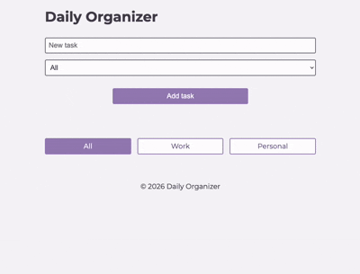

# Daily Organiser

🇬🇧 [English](README.md) | 🇯🇵 Japanese

シンプルなタスク管理アプリです。

仕事とプライベートのタスクを分けて管理できます。

HTML、CSS、JavaScriptを用いて開発しました。

## Live Demo

👉🏻 https://daily-organiser-2.vercel.app/

## Preview

## Background

日頃からNotionを利用する中で、最もよく使っていた機能がTo-Doリストでした。そこで、必要な機能だけに絞ったシンプルなタスク管理アプリを作ろうと考えました。

また、Notionのデスクトップアプリは、ちょっとしたタスクをすぐにメモしたいときでも別ウィンドウを開く必要があり、手軽さに欠けると感じていました。ブラウザ版も利用できますが、初回利用時にはサインインが必要で、すぐに使い始められません。

そこで、「アカウント登録やサインインをせずに、思いついたタスクをすぐ記録できること」をコンセプトに、Daily Organiserを制作しました。

## Features

### タスクの追加・表示

思いついたタスクをすぐに記録し、一覧で管理できます。

### タスクの編集

内容が変わっても簡単に更新できます。

### タスクの削除（個別・一括）

不要なタスクを状況に応じて削除できます。

### 完了状態の管理

完了したタスクを視覚的に区別し、進捗を把握しやすくします。

### ローカルストレージへの保存

ログイン不要で、ブラウザを閉じてもタスクを保持できます。

### カテゴリ別フィルタリング

仕事とプライベートのタスクを切り替えながら管理できます。

## Tech Stack

### Frontend
- HTML
- CSS
- JavaScript

### Deployment
- Vercel

## Technology Choices

CRUD操作、ローカルストレージ、カテゴリフィルタリングといった基本的な機能の実装に集中するため、HTML、CSS、Vanilla JavaScriptを採用しました。

フレームワークには依存せず、DOM操作やデータ管理について、Web標準の技術を用いて理解を深めることを目的としました。

## System Design

仕事とプライベートのタスクを簡単に切り替えられるよう、**All**、**Work**、**Personal** の3つのタブを用意しました。

現在選択中のタブにはアクセントカラーを適用し、どのカテゴリを表示しているかをすぐに把握できるようにしています。

また、各タスクにはカテゴリラベルを表示し、一覧表示でも仕事とプライベートのタスクを区別しやすいデザインにしました。

## Implementation Highlights

データ管理とUI描画の責務を分離した構成を採用しました。

すべてのタスクは`tasks`配列で一元管理し、このデータを基に追加・編集・削除・完了状態の更新を行っています。画面表示も常にこのデータから描画することで、データとUIの整合性を保ちやすい設計にしました。

また、入力内容は保存前に前後の空白を自動で削除し、不要なスペースが保存されないようにしています。

さらに、キーボード操作にも対応しており、**Enterキーで保存**、**Escapeキーでキャンセル**できるため、マウスに頼らず効率的にタスクを管理できます。

## Challenges & Solutions

課題の一つは、タスクデータの管理方法と、一意なIDをどのように付与するかを設計することでした。

そこで、各タスクを **ID・内容・カテゴリ・完了状態** を持つオブジェクトとして管理する構成を採用しました。

この構造により、個々のタスクを簡単に編集・削除・更新できるようになっただけでなく、将来的な機能追加にも対応しやすい設計になっています。

## Future Improvements

今後は、アクセシビリティの向上に取り組みたいと考えています。

フォームやボタンに`aria-label`などの適切なアクセシビリティ属性を追加し、スクリーンリーダーでも利用しやすいUIへ改善する予定です。

また、配色やコントラストも見直し、より読みやすく使いやすいインターフェースを目指します。

## License & Usage

このリポジトリは、ポートフォリオとして公開しています。

ソースコードはオープンソースではなく、開発内容や技術力を紹介する目的で公開しています。

## Explore More Projects

GitHubプロフィールでは、他のプロジェクトも公開しています。

👉🏻 https://github.com/htm823